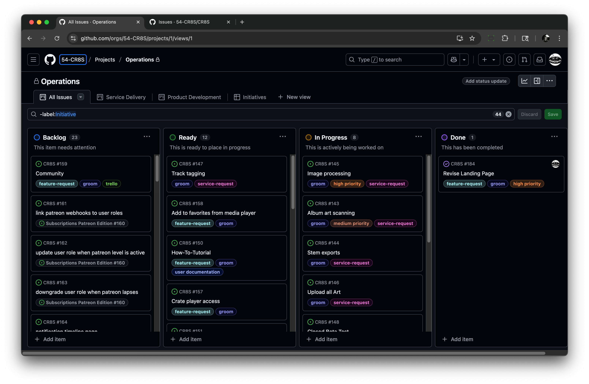
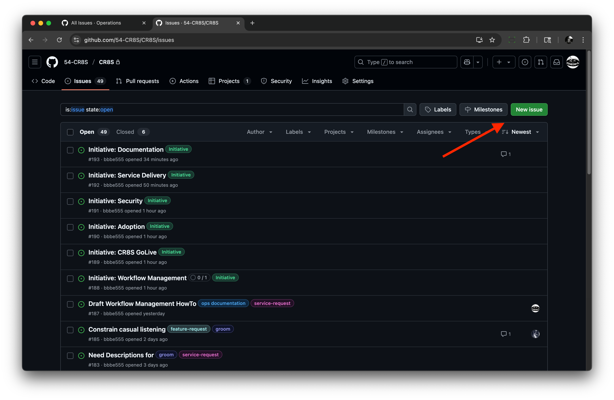
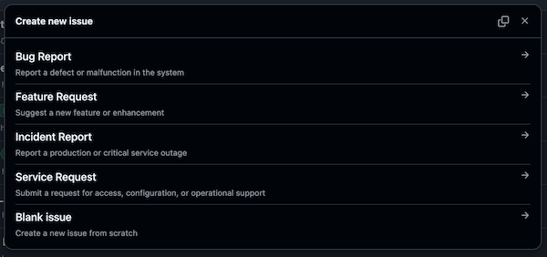

# Workflow Management

## Overview

This guide describes the tools we're using to manage work and how to use them.

- Tools and Services
- Rituals, Routines, and Process

## Contents

- [Overview](#overview)
- [Getting Started](#getting-started)
- [Tools and Services](#tools-and-services)
  - [GitHub Issues](#github-issues)
  - [CR8S Operations Board](#cr8s-operations-board)
  - [Issue Types](#issue-types)
  - [Creating New Issues](#creating-new-issues)
  - [Issue Management](#issue-management)
    - [Backlog Queue](#backlog-queue)
    - [Triage Process](#triage-process)
    - [Grooming Steps](#grooming-steps)
    - [Planning & Prioritization](#planning--prioritization)
    - [Escalating Urgent Issues](#escalating-urgent-issues)
- [Rituals](#rituals)
  - [Roadmap](#roadmap)
  - [Planning](#planning)
  - [Standups](#standups)
- [Providing Feedback](#providing-feedback)
- [Glossary](#glossary)
- [Workflow Summary](#workflow-summary)
- [Caveats](#caveats)

## Getting Started
New team members should follow these steps to get started:
1. **Access GitHub**: Ensure you have a GitHub account and access to the [54-CR8S organization](https://github.com/54-CR8S).
2. **Join the Operations Board**: Request access to the [Operations Board](https://github.com/orgs/54-CR8S/projects/1) from your team lead.
3. **Familiarize with Issue Types**: Review the [Issue Types](#issue-types) to understand how work is categorized.

## Tools and Services

### GitHub "Issues"

GitHub repositories use [issues](https://docs.github.com/en/issues/tracking-your-work-with-issues/about-issues) to organize work. Think of them as the atomic level basic work item. They can be as brief or expansive as necessary, including having sub-tasks added for large multi-stepped tasks or projects.

### CR8S Operations Board

The [Operations Board](https://github.com/orgs/54-CR8S/projects/1) is a Kanban board that organizes issues into columns (e.g., Backlog, In Progress, Done) to track and prioritize all CR8S work.

### Issue Types

We use different issue types to categorize work:

| Issue Type        | Purpose                                  | Example Use Case                     |
|-------------------|------------------------------------------|--------------------------------------|
| **Bug Report**    | Report defects or malfunctions           | "App crashes when opening the player" |
| **Feature Request** | Suggest new features or enhancements   | "Add dark mode to the UI"           |
| **Incident Report** | Report critical issues or outages      | "Server down for 30 minutes"        |
| **Service Request** | Handle operational tasks                | "Grant access to new team member"   |

### Creating New Issues

Use the [CR8S Issues page](https://github.com/54-CR8S/CR8S/issues) to create and manage issues.

The "New Issue" button will open the menu to select the issue types described above. A **Blank issue** selection will work if you're unsure which form to use.

> **Example Bug Report**:
> **Title**: Login page fails to load  
> **Description**: Users see a 500 error when accessing the login page on v2.3.1.  
> **Scope/Impact**: Affects all users; reported by 5 customers.  
> **Contact**: John Smith (john@company.com).  
> **Labels**: `bug`, `high-priority`

### Issue Management

#### Backlog Queue
New issues are automatically added to the **Backlog** column on the [Operations Board](https://github.com/orgs/54-CR8S/projects/1) with a `triage` label. Labels help categorize and prioritize work.

> **When to create an issue**: Create an issue for any work, such as:
> - Proposing new features
> - Requesting changes
> - Reporting bugs or outages
> - Handling operational tasks (e.g., access requests)

#### Triage Process
Triage ensures issues have enough information to act on. Urgent issues (bugs, incidents) should be triaged immediately.

**Steps**:
1. **Check completeness**: Confirm the issue includes scope, impact, and contact details.
2. **Escalate urgent issues**: For bugs or incidents, assign and apply `high-priority` if critical.
3. **Remove `triage` label**: Once triaged, remove the label to move to grooming.

**Checklist**:
- [ ] Scope and impact described.
- [ ] Contact information provided.
- [ ] Urgent issues assigned and escalated.
- [ ] `triage` label removed.

> **Tip**: Triage issues as soon as they’re reported to avoid delays, especially for bugs or incidents.

#### Grooming Steps
Grooming refines issues to make them ready for work by clarifying requirements.

**Steps**:
1. **Review the issue**: Ensure the description is clear and actionable.
2. **Add a user story**: If unclear, rephrase as "As a [user], I want to [action] so that [benefit]."
3. **Define the Definition of Done**: List criteria for completion (e.g., "Feature tested and deployed").
4. **Remove the `groom` label**: Confirm the issue is ready for planning.

**Checklist**:
- [ ] Description is clear and actionable.
- [ ] User story added (if applicable).
- [ ] Definition of Done specified.
- [ ] `groom` label removed.

> **Example User Story**:  
> As a user, I want to reset my password easily so that I can regain access to my account quickly.

#### Planning & Prioritization
Planning assigns effort and priority to groomed issues for scheduling.

**Steps**:
1. **Clarify the goal**: Confirm the user story or add one if missing.
2. **Set the Definition of Done**: Ensure completion criteria are clear.
3. **Estimate effort**: Use t-shirt sizes:
   - **Small**: <1 day (e.g., minor bug fix).
   - **Medium**: 1-3 days (e.g., small feature).
   - **Large**: >3 days or complex (e.g., system overhaul).
4. **Assign priority**: Low priority is assumed, so add `medium`, or `high` labels based on impact:
   - **Low**: Non-urgent tasks.
   - **Medium**: Impacts a subset of users or processes.
   - **High**: Critical issues blocking operations or affecting many users.
5. **Assign owners**: Add team members to the issue.

#### Escalating Urgent Issues
For critical bugs or incidents:
- Notify the team lead via Slack or email.
- Apply the `high-priority` label.
- Escalate to the on-call engineer if the issue impacts service availability.

## Rituals
Rituals are regular meetings to align, plan, and track progress. They integrate with the Operations Board to keep work on track.

### Roadmap
- **Purpose**: Align on long-term goals and objectives for CR8S.
- **Process**: Regular (quarterly) meetings to review and update the product roadmap, prioritizing high-impact features and fixes.
- **Tools**: Use the Initiatives view on the Operations Board to consider ongoing commitments and goals.

### Planning
- **Purpose**: Groom, plan, prioritize and queue or assign issues for upcoming work.
- **Process**: Regular sessions (weekly) to review the backlog, estimate effort, and set priorities on the Operations Board.
- **Tools**: Update the Operations Board during planning to reflect priorities, noting priority labelling and placement in the work queues, (Ready, In Progress, etc.)

### Standups
- **Purpose**: Share progress, identify blockers, and coordinate daily work.
- **Process**: Regular (daily) 15-minute meetings (in-person or virtual) where each team member answers:
  - What did I do yesterday?
  - What am I doing today?
  - Any blockers?
- **Asynchronous Standups**: In lieu of regular daily standups, team members should provide standup level status in a dedicated channel or thread.
- **Tools**: Reference the Operations Board to discuss issue status. Share updates on Slack, email, or some other asynchronous shared platform.

## Providing Feedback
If tools or processes hinder delivering quality results:
- Share feedback during Standups or Planning sessions.
- Open a [Feature Request](#issue-types) to suggest workflow improvements.
- Discuss with the team lead for urgent process issues.

## Glossary
- **Triage**: Reviewing new issues to ensure they have enough information to act on.
- **Grooming**: Refining an issue to clarify requirements and prepare it for work.
- **User Story**: A simple description of a feature from the user’s perspective, e.g., "As a user, I want to [action] so that [benefit]."
- **Definition of Done**: Criteria confirming an issue is fully resolved or completed.
- **Operations Board**: A Kanban board in GitHub for tracking and prioritizing issues.

## Workflow Summary
1. **Create Issue**: Use the [CR8S Issues page](https://github.com/54-CR8S/CR8S/issues) to open a Bug, Feature, Incident, or Service Request.
2. **Triage**: Add scope, impact, and contact details; remove `triage` label.
3. **Groom**: Clarify requirements, add user story and Definition of Done; remove `groom` label.
4. **Plan**: Estimate effort (S/M/L), set priority (Low/Medium/High), and assign owners.
5. **Track**: Monitor progress on the [Operations Board](https://github.com/orgs/54-CR8S/projects/1).
6. **Review**: Attend Standups, Planning, and Roadmap sessions to stay aligned.

## Caveats
These tools and processes aim to streamline work, ensure predictable throughput, and align with business goals. If they get in the way:
- Use discretion to bypass gaps or broken handoffs.
- Raise feedback promptly to improve the workflow.
- Focus on delivering quality, timely results.

> **Note**: This is a simplified workflow without strict sprint scheduling. Adjust as needed based on team priorities and resources.
